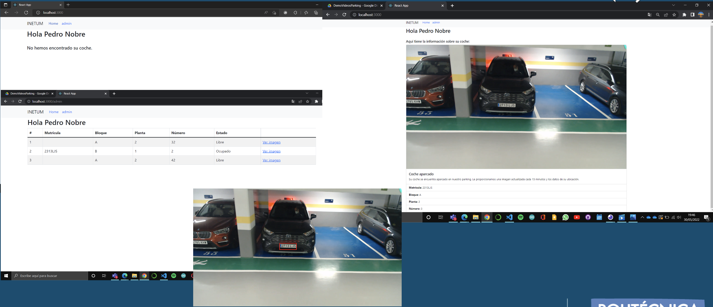

**This project was part of my university internship at the R&D department of Inetum, conducted during my studies at Universidad Politécnica de Madrid (UPM) in early 2022. I was awarded special distinction for my work. **

# parkAI: parking manager
Car detector system for underground parking lots. 

## Demo

## System structure:
 
`/server`: Holds the server. Built upon the following modules:
   - `server.py`: Flask server with both the endpoints to be consumed by the end users and the ones for processing the images sent and captured by the ESP32 board. 
   - `/Model`: Fine tuned YOLO5 model for detecting vehicles and fine tuned ocr for detecting license plates.  
   - `/data`: Saved images with time-stamp. 

`/firmware`:  Hosts the Arduino/ESP32 firmware. Built upon the following modules: 
   - `anea.ino`: Main arduino firmware for capturing and sending the image to the server.
   - `mesh`:  TODO - Harness painlessMesh library to build up an ad-hoc network for transmiting parking availability. 
   - `Config manager`: TODO -  Manage wifi credentials. Turns on an access point and allow configuration updates - latency, wifi credentials, resolution...
   - `EPPROM manager`: TODO -  Write, update and read data from EEPROM (manage wifi credentials).
`/client`:  Fronted. Built upon the following modules: 
   - `main.js`: React app for consuming and displaying data.
  
## Lab:
 - Jupyter Notebook playground for testing and experimenting novel solutions. 

## Getting started
### Hardware:
    - ESP32-CAM board. 
    - OV2640 camera module.
#### Board specs:
    - 802.11b/g/n Wi-Fi
    - Bluetooth 4.2 with BLE
    - UART, SPI, I2C and PWM interfaces
    - Clock speed up to 160 MHz
    - Computing power up to 600 DMIPS
    - 520 KB SRAM plus 4 MB PSRAM
    - Supports WiFi Image Upload
    - Multiple Sleep modes
    - Firmware Over the Air (FOTA) upgrades possible
    - 9 GPIO ports
    - Built-in Flash LED

#### Camera specs:
    - Megapixel sensor
    - Array size UXGA 1622×1200
    - Output formats include YUV422, YUV420, RGB565, RGB555 and 8-bit compressed data
    - Image transfer rate of 15 to 60 fps

### Running the server:

Requirements: Have Python 3.6+ installed.

Steps for execution: 

#### Server: creating  and setting up virtual environment:

Run on terminal: 
    - python -m venv env

    - source env/bin/activate

Dewnload dependencias

    - python install -r requirements.txt
 
Run the server: 
    - python server.py

Update server.py with your IP.  

#### firmware
    - Update parkAI.ino with wifi credentials and servername and port. 
    - Install arduino and spressif ESP32 firmware. 
    - Install dependencies. 
    - Deploy the parkAI firmware to the board via USB cable or over the air. 

#### client

Run: 
- Require nodejs
- npm install to install all dependencies
- npm start to run the react client
